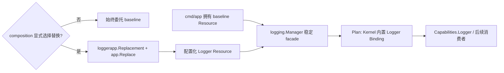

# 开发设计：Kernel 内置 Logger 的可选 App 替换

## 1. 设计结论

本任务保留现有 mandatory baseline 与 `logging.Manager`，把 Manager 的稳定 `pkg/logger.Logger` facade 作为 Plan 中的 Kernel 内置能力。配置化 Logger App 改为没有独立输出的替换节点，并通过 typed target Binding 连接到该内置能力。



Binding 的输出对象始终是同一个 Manager facade。替换只改变 facade 的内部委托目标，不更换 Binding 输出身份，因此已注入消费者和旧 `With` 子 Logger 都不需要重建。

## 2. 包边界与所有权

```text
cmd/app
  -> pkg/logger.Resource                  # 创建并关闭 baseline
  -> internal/kernel/logging.Manager      # 创建并注入 Kernel

internal/kernel
  -> logging.Manager                      # 必填，执行期成功日志
  -> app.FrozenPlan

internal/kernel/composition
  -> runtime.LoggerTarget()               # 同一 Manager 的 typed 内置 target
  -> app.Add / app.Replace

internal/kernel/app/logger
  -> pkg/logger                           # 配置、Resource、Logger
  -> internal/kernel/logging              # typed Target 控制契约
  -> internal/kernel/app                  # ReplacementDefinition
```

目标所有权不变：

- baseline Resource：`cmd/app` 创建、关闭；
- Manager：应用入口创建，Kernel 持有并输出稳定 Logger；
- configured Resource：Logger Replacement 创建、Kernel 生命周期关闭；
- 消费者：只能调用 `pkg/logger.Logger`，不能关闭任何共享 Resource，也不能取得 Replacement 控制权。

## 3. Kernel 内置 Logger

Kernel 增加语义明确的只读与 typed target 入口，移除 composition 对具体 `LoggingManager()` getter 的依赖：

```go
type Target interface {
	Logger() pkglogger.Logger
	Replace(pkglogger.Logger)
	Restore()
}

func (k *Kernel) Logger() pkglogger.Logger
func (k *Kernel) LoggerTarget() kernellogging.Target
```

实际实现仍由同一个 `*logging.Manager` 持有委托状态。Manager 返回一个动态类型不具备 `Replace/Restore` 的稳定只读 view；`Kernel.Logger()` 和 `Capabilities.Logger` 只暴露该 view。`LoggerTarget()` 只在 `internal/kernel` 边界供 composition 建立 target Binding，不进入 `Capabilities`，也不传给其他组件。

内置 Logger ID 由 Kernel 语义所有者集中声明，例如：

```go
const BuiltinLoggerID app.ID = "kernel.logger"
```

composition 使用 `app.Value` 把同一个 Manager 的 typed target 加入 Plan：

```go
definition, err := app.Value(kernel.BuiltinLoggerID, runtime.LoggerTarget())
if err != nil {
	return err
}
builtinLogger, err := app.Add(plan, definition)
```

这是固定能力身份和 typed Binding，不转移 baseline 所有权，也不产生 Kernel 运行节点、Defaults 或空生命周期。最终 `Capabilities.Logger` 取 `builtinLogger.Output.Logger()` 的稳定只读 view，不把 target 对象放入字段，因而动态类型也不泄漏 `Replace/Restore`。

## 4. 最小 Replacement API

### 4.1 类型分离

新增与普通 Definition 分离的声明类型和唯一装配操作：

```go
type ReplacementDefinition[T any] struct {
	// 私有字段，携带替换组件 ID、配置、运行节点，
	// 并用 T 接收 target Binding 解析出的同一个实例。
}

func Replace[T any](
	plan *Plan,
	target Binding[T],
	replacement ReplacementDefinition[T],
) error
```

公开类型关系提供以下约束：

- `app.Add` 只接收 `Definition[T]`；
- `app.Replace` 只接收 `ReplacementDefinition[T]`；
- target 与 replacement 的 `T` 必须一致；Logger 当前固定为 `kernellogging.Target`；
- replacement 没有 `Added.Output` 和新 Binding，消费者继续使用 target 输出。
- `Replace` 从 target Binding 解析实例并注入 replacement；replacement 构造函数不另收 target，避免 Binding 与实际被切换对象身份错配。

组件作者通过 app 包提供的 configured managed replacement 构造器建立私有运行节点。具体泛型 helper 可因 Go 类型推导做小幅命名调整，但必须保持上面 `ReplacementDefinition[T] + Replace(plan, Binding[T], ...)` 的公开关系；若实现探针证明不可表达，需要先更新方案并重新确认。

### 4.2 Plan 约束

Plan 增加私有 replacement target 占用信息。`Replace` 按以下顺序先完整校验、后一次写入：

1. Plan 非 nil 且仍为 open；
2. replacement ID、构造器和配置元数据有效；
3. target Binding 非零，属于同一 Plan，已经在 replacement 之前加入且 token 匹配；
4. replacement ID 不与普通组件或其他 replacement 重复；
5. target 尚未被其他 replacement 占用；
6. replacement 运行节点、Defaults 和 CLI 元数据能够完整建立。

任何失败都不改变 `ids`、运行节点、Defaults、CLI 或 target 占用。Freeze 复制 replacement 元数据所形成的运行计划；Kernel 不提供运行期追加或查询替换关系。

当前只授权 Logger 使用该 API。以后其他内置能力是否适合稳定 facade 替换，必须基于真实资源、排空和所有权重新立项，不能仅因 API 存在就直接套用。

## 5. Logger Replacement 组件

`internal/kernel/app/logger` 单轨改为：

```go
const (
	ID         app.ID = "logger.configured"
	ConfigPath        = "logger"
)

func Replacement() (app.ReplacementDefinition[kernellogging.Target], error)
```

该构造函数明确声明：

- 组件是 Kernel Logger 的 replacement，不是独立 Logger Capability；
- target 由 `app.Replace` 从同一 Plan 的 Binding 注入；解析结果必须非 nil；
- Decode/Validate、Defaults、Build 和 Stop 延续当前实现；
- 发布/提交时 `target.Replace(resource)`；停止当前代前 `target.Restore()`；
- 不创建 `loggerapp.Access`、Lease facade、Output 或 Binding。

通用 `WithActivation` 当前只有 Logger 使用。迁移后从普通 Definition Option 中删除，替换激活/撤回成为 `ReplacementDefinition` 的必需内部契约，避免普通组件用一个隐藏回调产生未声明的替换副作用。

## 6. Composition 选择

使用专用枚举表达有限选择：

```go
type LoggerSelection uint8

const (
	KernelBuiltinLogger LoggerSelection = iota
	ConfiguredLoggerReplacement
)

type Options struct {
	Logger LoggerSelection
	CLI    *CLIOptions
}
```

`Compose` 的目标流程：

```go
plan := app.NewPlan()

builtinLogger, err := composeBuiltinLogger(plan, runtime.LoggerTarget())
if err != nil { return Capabilities{}, err }

switch options.Logger {
case KernelBuiltinLogger:
	// 不加入 replacement。
case ConfiguredLoggerReplacement:
	err = composeLoggerReplacement(
		plan,
		builtinLogger.Binding,
	)
default:
	return Capabilities{}, fmt.Errorf("unsupported logger selection %d", options.Logger)
}

// clock -> idgen -> validation -> database -> Freeze -> Defaults/CLI -> Install

return Capabilities{
	Logger: builtinLogger.Output.Logger(),
	// 其余字段保持现有类型。
}, nil
```

`Capabilities.Logger` 改为 `pkglogger.Logger`。它在两种选择下都非 nil且身份稳定：

| 选择 | Logger 运行节点 | `logger` Defaults | 启动后委托目标 |
| --- | --- | --- | --- |
| `KernelBuiltinLogger` | 无 | 无 | baseline |
| `ConfiguredLoggerReplacement` | 有 | 有 | 成功发布的 configured Resource |

`cmd/app` 在构造 `composition.Options` 时明确填写 `ConfiguredLoggerReplacement`，CLI 与服务模式保持一致。因而当前应用的 `config init`、示例配置和服务启动契约不变；`Options{}` 则成为可测试的 baseline-only composition。

## 7. 生命周期和失败语义

### 7.1 初始启动

```text
baseline serving
  -> Decode/Validate configured candidate
  -> Build Resource
  -> optional Start/Ready
  -> replacement Activate: Manager.Replace(candidate)
  -> 后续组件启动
```

候选在 Activate 前失败时只清理候选，Manager 继续指向 baseline。后续组件启动失败时按反向顺序停止已发布节点；Logger replacement 撤回到 baseline 后关闭 configured Resource。

### 7.2 Reload

沿用 Kernel 现有“全部候选先准备、变化节点反向 drain、不可失败提交、旧代反向关闭”事务。Logger replacement 在提交区切换 Manager；候选失败或 drain 回滚不切换目标。成功提交后，新日志进入新 Resource，旧 Resource 再被关闭。

Manager 在每次日志方法调用期间持有读锁；`Replace/Restore` 获取写锁，因此会等待正在执行的同步日志写入结束。Logger 不再暴露允许任意长回调的独立 `Access.Use`，避免 baseline-only 与 configured 两种模式出现不同租约 API。

### 7.3 Stop

Host 先停止使用 Logger 的上层 Participant。Kernel 随后反向停止组件；Logger replacement 在关闭 configured Resource 之前执行 Restore。Kernel 的 `kernel stopped` 成功日志因此写入 baseline，入口最后关闭 baseline Resource。

若 Stop 失败，保持当前错误链与 `errors.Join` 规则；不能记录成功或返回 nil 掩盖恢复/关闭失败。

## 8. 单轨迁移与文件影响

预计修改：

- `internal/kernel/app/definition.go`：增加 `ReplacementDefinition[T]` 与 managed replacement 构造支持；
- `internal/kernel/app/plan.go`、`binding.go`：增加 `Replace`、target 校验、唯一性和失败原子性；
- `internal/kernel/app/contracts.go`：把替换激活从普通 `WithActivation` 中移出；
- `internal/kernel/app/logger/logger.go`：删除独立 Access，改为 `Replacement`；
- `internal/kernel/logging/manager.go`：抽取只读 Logger 与 typed target 控制契约，保持 Manager 并发语义；
- `internal/kernel/kernel.go`：提供内置 Logger 只读与 typed target 入口；
- `internal/kernel/composition/composition.go`、`logger.go`：加入内置 Binding、枚举选择和显式 Replace；
- `cmd/app/main.go`：直接依赖 `pkglogger.Logger`，显式选择 configured replacement；
- 对应单元测试与边界测试；
- 根 README、`internal/kernel/README.md`、`internal/kernel/app/README.md`、必要的 `pkg/logger/README.md`。

预计删除或替换的旧符号：

```text
loggerapp.Access
loggerapp.Definition
composeLogger
runtime.LoggingManager
app.WithActivation          # 当前没有其他真实调用方
普通 app.Add(logger definition)
```

不修改 `go.mod/go.sum`，不新增外部依赖。`config.example.yaml` 的字段保持有效；若实现无需改变其说明，则不为制造 Diff 而修改。

## 9. 测试设计

### 9.1 Plan 与类型边界

- normal Definition 只能 Add，ReplacementDefinition 只能 Replace；
- target 的零值、跨 Plan、错误 token、错误顺序与泛型类型不匹配；
- 同一 target 重复替换、replacement ID 与普通 ID 冲突；
- Replace 失败前后 Plan 的节点、Defaults、CLI、ID 和 target 占用完全一致；
- Freeze 后 Replace 失败，FrozenPlan 副本不可变。

类型不匹配优先通过编译期测试/示例证明；无法作为运行期单测表达的负例不使用反射绕过。

### 9.2 Manager 与 Logger Replacement

- baseline 必填，`Capabilities.Logger` 不暴露 Close/Replace，target 不离开 Kernel composition；
- 旧 Logger 引用和多层 `With` 在 Replace/Restore 后跟随当前目标；
- 并发日志与 Replace/Restore 通过 race；
- Definition 拒绝 nil replacement target；
- Decode/Build 失败不替换，成功发布才替换；
- Reload 成功切换并只关闭旧 Resource 一次，失败保留旧目标；
- Stop 先 Restore 再 Close，最终 Kernel 成功日志进入 baseline。

### 9.3 Composition 与入口

- `Options{}` 返回配置加载前即可使用的 baseline Logger，Defaults 不含 `logger`；完整 Plan 的 Database 仍要求既有有效配置；
- configured selection 返回同一个稳定 Logger，Defaults 含 Logger 且排在 Database 前；
- 未知选择返回零 Capabilities，Kernel 未安装部分 Plan；
- CLI 开关与 Logger 选择相互独立；
- `cmd/app` CLI/服务两条路径都显式选择 configured replacement；
- application lifecycle 直接使用 `pkglogger.Logger`，启动、停止顺序不退化。

### 9.4 实施后验证门禁

```powershell
gofmt -w <007 修改的 Go 文件>
go mod tidy
git diff --exit-code -- go.mod go.sum
go build ./cmd/app
go test ./...
go test -race ./...
go vet ./...
git diff --check
```

另外执行旧符号和文档描述搜索。`go mod tidy` 只用于确认依赖图；若产生非预期依赖变化，停止并调查。本任务不启动需要真实 Database 的服务，不把未执行的外部资源验收声明为通过。

## 10. 设计取舍

没有采用“所有 Kernel 内置能力 Catalog + replacement phase/priority/visibility + 多层覆盖”的方案，因为当前只有 Logger 有真实 mandatory baseline、稳定 facade 和替换资源。提前抽象会扩大 API、迁移 Config/CLI/Database，并产生没有消费者的策略。

本方案只增加一个 typed target Binding 和显式 Replace 语义，足以让代码表达用户要求的替换关系，同时保留将来基于第二个真实案例再提炼公共模型的空间。
