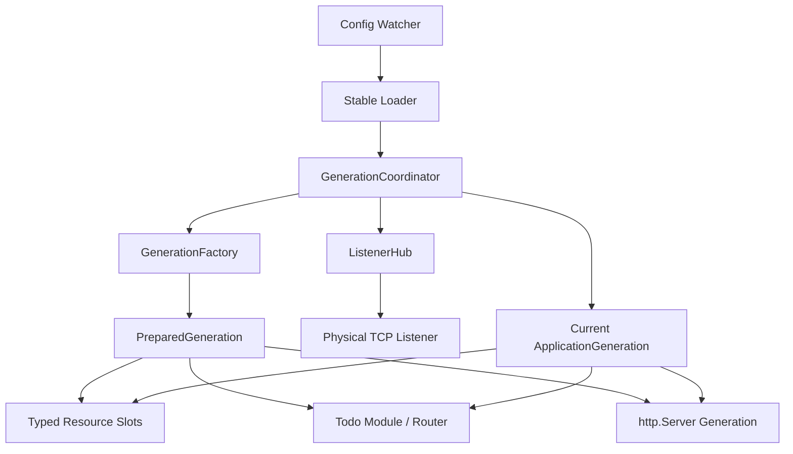
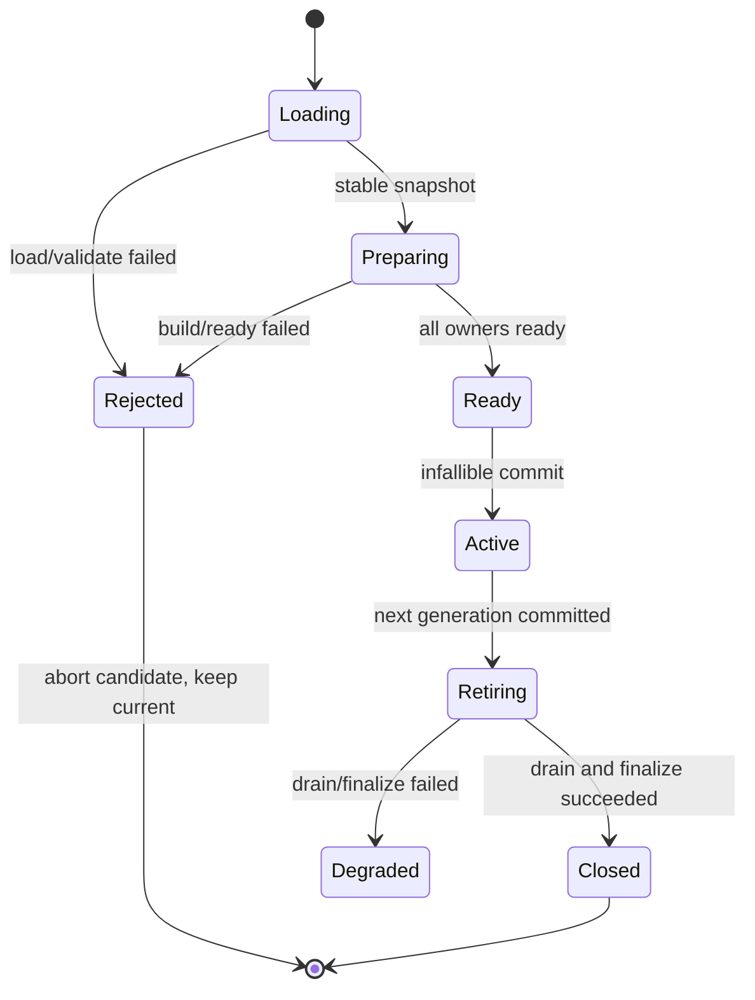

# 设计：全配置无感重载

## 1. 设计结论

长期 Service 从“Kernel 逐组件重载 + Application 固定对象图”单轨迁移为“进程基线 + 不可变 Application Generation”。一次 reload 只从一个稳定 Snapshot 构建一个完整候选代；候选全部 Ready 后在一个不可失败的提交点切换新连接，旧代停止 admission、排空请求并反向终结。

本文件描述目标设计，不代表当前代码已经实现。目标接口名可在不改变本设计语义的前提下做局部调整；若改变模块边界、提交语义、listener 所有权或资源复用策略，必须退回待确认。

## 2. 目标结构



### 2.1 进程基线

不随 watched config 一起替换：

- `Config Watcher`：只产生 reload 请求，串行、latest-wins；
- `Stable Loader`：稳定采样 File，再应用 Env，输出 immutable Snapshot；
- baseline logger：保证 candidate 构造失败时仍有诊断出口；
- `GenerationCoordinator`：拥有 current、candidate、retiring 与 cleanup debt；
- `ListenerHub`：拥有物理 TCP listener、accept loop 和 route handoff；
- signal/shutdown owner：停止 watcher、关闭 admission、排空并终结全部代际。

### 2.2 Application Generation

每一代显式持有：

- generation ID、Snapshot digest、section digests；
- Logger、Database、Cache、I18n、Storage 的 typed resource reference；
- Todo Repository、Policy、Service、Handler、Router；
- generation-owned `http.Server` 与虚拟 listener route；
- active connection/request、admission 状态与反向终结 journal。

发布后的代际不可变。业务代码只接收已构造的项目能力接口，不接收 Coordinator、Snapshot、资源 registry 或 Close 权。

## 3. 包边界与目标契约

### 3.1 依赖方向

- `internal/kernel` 只定义通用 Snapshot、reload 状态机和窄 `GenerationFactory` 协议，不导入具体 Todo composition。
- `internal/composition` 实现具体 Factory，按依赖顺序构造 Capabilities、Todo 与 HTTP 对象图。
- `pkg/httpx` 实现与业务无关的 `ListenerHub`、虚拟 `Route` 和 generation server 生命周期。
- 各 capability package 继续拥有 Config、校验、构造、Ready 与 Close 语义。
- `internal/module/todo` 不导入 Kernel，也不运行时查询能力。

### 3.2 计划接口

以下是计划中的语义接口，不是已存在 API：

```go
type GenerationFactory interface {
	Prepare(ctx context.Context, snapshot config.Snapshot, previous GenerationView) (*PreparedGeneration, error)
}

type PreparedGeneration interface {
	Ready(ctx context.Context) error
	Commit() *ApplicationGeneration
	Abort(ctx context.Context) error
}

type ListenerHub interface {
	Prepare(address string) (PreparedRoute, error)
	Commit(next PreparedRoute, previous ActiveRoute) ActiveRoute
	Stop(ctx context.Context) error
}
```

最终实现应使用具体类型表达不变量，避免以大接口、`map[string]any` 或运行时类型查找承载对象图。`PreparedGeneration.Commit` 只发布已经完成的对象，不执行 I/O、启动 goroutine 或返回失败。

## 4. 稳定配置候选

### 4.1 读取算法

1. watcher 合并 debounce 窗口内事件，只提交最新 reload intent；
2. 在总 reload deadline 内读取文件身份、内容和 digest；
3. 遇到 Windows sharing violation、atomic rename 的短暂不存在时执行有界退避；
4. 连续两次读取的文件身份、长度与 digest 一致，才认定 File 稳定；
5. strict decode、默认值、File < Env merge 和 owner validation；
6. 与 current effective digest 相同则记录 no-op，不构造新代。

重试只接受可识别的瞬时文件错误。权限错误、目录代替文件、稳定非法 YAML 和 owner validation 必须直接拒绝并保留旧代。Snapshot digest 与日志字段不得包含 secret 明文。

### 4.2 连续修改

同一时刻只允许一个 candidate。构造期间到达的新事件标记 dirty；当前 attempt 完成后立即重新采样最新文件，不排队保存过时 Snapshot，也不允许无界 candidate。

## 5. Typed Resource Slot

资源复用按 capability 所有者定义的 typed key 与 section digest 决定：

- digest 未变：candidate 增加旧资源引用；
- digest 改变：构造新资源并执行 Ready；
- Abort：反向释放 candidate 新建资源与已获取引用；
- Commit：引用转归新 generation；
- retire：旧 generation 释放引用，引用归零后 owner Close。

不建立万能资源 registry。每类资源的 key、Ready、Close、终结重试策略由 typed owner 明确实现。Cache 的 typed Client、L1 和 tag index 必须属于 generation，不能因 Redis resource 复用而跨代共享。

## 6. Candidate 构造顺序

一次 candidate 使用同一 Snapshot，按下列顺序准备并登记反向终结 journal：

1. 解析 section digests，确定资源复用或重建；
2. 构造 configured Logger，但 baseline logger 仍负责候选期诊断；
3. 构造 Database 并完成 Ping 与只读 schema readiness；
4. 构造 Cache、I18n、Storage 并完成各 owner Ready；
5. 构造 Todo Repository、immutable Policy、Service、Handler、Router；
6. 为目标地址准备物理 listener 或复用现有 listener；
7. 构造 generation `http.Server`，连接虚拟 route，进入 Serve-ready；
8. 汇总 Ready 证据，生成 `PreparedGeneration`。

reload 不执行 schema migration。缺表、版本不兼容或目标数据未准备好在 commit 前失败；跨 Database/Storage 的业务数据迁移由独立计划处理。

## 7. ListenerHub 协议

### 7.1 所有权

每个实际地址只有一个 process-owned physical listener 和一个 accept loop。每代 `http.Server` 调用标准 `Serve`，但参数是 Hub 提供的虚拟 route，而非物理 listener。候选 route 在提交前可让 `Serve` 阻塞等待，不能获得生产连接。

### 7.2 同地址 handoff

Hub 在互斥提交区完成：

1. 禁止旧 route 接收新的 dispatch；
2. 把物理 accept loop 的 active route 指向 candidate；
3. 明确归属已 accept、尚未 dispatch 的 pending connection；
4. 开放 candidate route；
5. 返回 retiring route 供旧 `http.Server.Shutdown` 排空。

pending connection 必须在提交屏障内明确归入旧代或新代；不得关闭后丢弃，也不得用无 owner 的逐连接 goroutine 转发。队列有固定容量和背压，Hub Stop/route Close 必须唤醒所有阻塞 Accept。

### 7.3 地址变化

candidate 先为新地址完成 `net.Listen` 和 Serve-ready。commit 后新地址开放，新连接不再投递旧地址；旧 physical listener 停止 accept，旧代已接受连接继续排空。若 bind 失败，current 完全不变。配置端口为 `0` 时 diagnostics 必须记录实际 bound address。

### 7.4 适用边界

首版只保证当前普通同步 HTTP/1.1 与 HTTP/2-over-current-server 能力，不扩展 TLS、HTTP/3、WebSocket、SSE 或 hijacked connection。任何新增协议必须先重新验证 connection ownership 与 drain 语义。

## 8. 提交、排空与失败状态机



### 8.1 唯一提交点

在 Coordinator 锁内只执行不可失败的内存发布：

1. current 指针从旧代切到新代；
2. ListenerHub active route 切换；
3. configured logger target 切换；
4. 记录 generation/diagnostic 状态。

所有可能失败的资源创建、Ready、goroutine 启动和 listener bind 都必须发生在 commit 前。不能在提交一半时尝试“回滚”外部资源。

### 8.2 旧代排空

commit 后关闭旧 admission，调用旧 `http.Server.Shutdown` 等待普通连接与请求。排空超时不强行把请求迁入新代；根据明确策略记录 timeout，并在进程关闭边界才允许使用 `Close` 强制终结。模块对象先停止，底层资源再按 journal 反向释放。

终结失败形成 typed cleanup debt：新代继续 active，但 readiness 为 false，后续 reload fail-closed，保留 owner/reference 供运维诊断。terminal finalizer 不盲目重试。

## 9. 各配置节生效方式

| 配置节 | candidate 行为 | commit 后行为 |
| --- | --- | --- |
| `logger` | 构造 sink/level 并 Ready | 新代业务日志进入新 target；旧请求排空旧 sink |
| `database` | 新 DSN 建池、Ping、只读 schema readiness | 新代 Repository 固定新 pool |
| `cache` | 构造 backend 与 generation-owned Client/L1 | 新代不观察旧 L1/tag index |
| `i18n` | 构造 locale/bundle 实例 | 新代 Handler 固定新实例 |
| `storage` | 构造目标并 Ready | 新代固定新 storage；不承诺数据迁移 |
| `todo` | 重建 immutable Policy、Service、Handler、Router | 新请求固定新 policy |
| `http` | 新建 `http.Server` 与 route；地址变化先 bind | 新连接由新 transport generation 服务 |

## 10. 单轨迁移

实施按“先建立新路径、同一任务完成调用方切换并删除旧路径”执行，最终状态不保留两套 coordinator：

1. 建立 stable loader 与 ListenerHub 可证伪原型；
2. 建立 generation contracts、typed resource ownership 与 composition factory；
3. 迁移 Service 启动、watcher reload、HTTP/Todo/Cache 和其余 capabilities；
4. 迁移 diagnostics、shutdown 与测试；
5. 删除长期 Service 的 section-level reload、`RestartRequired` 策略和仅验证不重建对象图的 binding；
6. 更新当前权威文档并搜索旧符号、旧配置语义和旧日志文案残留。

Application CLI 保持 invocation-scoped 构造/释放，不接入 watcher 和 ListenerHub。

## 11. 文件影响预估

计划修改范围以实际调用图为准，至少包括：

- `internal/kernel/config`：稳定采样与 Snapshot 诊断；
- `internal/kernel`：generation coordinator、状态、watcher 接线与旧 reload 路径删除；
- `internal/composition`：完整 generation factory 与 Service composition；
- `pkg/httpx`：ListenerHub、route、server 生命周期与跨平台测试；
- `pkg/adapter/{logger,database,cache,i18n,storage}` 对应 owner：typed resource 构造/Ready/Close；
- `internal/module/todo`：generation-owned Policy/Service/Handler/Router 构造；
- 配置、诊断、README、架构和组件开发文档；
- 单元、并发、集成、Windows/Linux runtime 验收。

实现前 `RLD-002` 必须用实际包路径复核本清单。不得为了匹配计划而虚构目录。

## 12. 验证设计

### 12.1 单元与并发

- stable file：原地写、atomic rename、sharing violation、稳定非法文件、deadline/cancel；
- Coordinator：no-op、latest-wins、candidate abort、commit 线性化、cleanup debt；
- resource slot：复用、引用计数、反向释放、并发 retire；
- ListenerHub：same-address handoff、pending barrier、backpressure、Stop 唤醒、bind failure；
- Todo/Cache：Policy 与 L1 generation isolation；
- `go test -race` 覆盖 reload 与持续请求并发。

### 12.2 进程验收

在同一 PID 下逐节和组合修改配置，持续发送带 generation 证据的请求，验证：

- 无 connection-refused、reload 导致的 5xx 或 generation mixing；
- 旧长请求完成、新请求只进入新代；
- 地址变化先 Ready 后切换；
- 候选失败仍由旧代正常服务；
- Windows 与 Linux 的实际 listener 行为一致。

验收工具不得通过共享可变测试变量伪造代际证据；应从响应、资源目标或受控 diagnostics 观察真实对象图。

### 12.3 仓库门禁

- 定向 tests、`go test ./... -count=1`；
- `go test -race`（在支持 race 的环境）；
- `go vet ./...`、`go build ./cmd/app`；
- 文档相对链接、`git diff --check`；
- 搜索长期 Service 中旧 `RestartRequired`、per-component reload 和 application binding 残留。

## 13. 已知风险与重新确认

以下任一事实出现即停止非文档实施、更新研究与计划并重新确认：

- ListenerHub 原型不能证明 pending connection 无丢失或跨平台一致；
- 需要引入第三方 server/runtime 框架或平台专用 socket option；
- 需要改变公开 HTTP/CLI API、配置 key 或默认值；
- 需要自动 schema/data migration、双写或外部系统回切；
- 当前 synchronous profile 之外的新连接类型进入范围；
- 实际调用图要求新的模块边界或永久兼容层。
