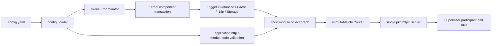

# R001：当前全配置重载边界与失败链路

## 1. 研究问题、方法与快照

本报告以 `e251b73518a457ec97c529d067ddfffe77be203a` 为代码快照，回答：当前哪些配置已经能热切换，`HTTP`、`Todo`、`Cache` 为什么不能，仅把三个 section 改成 `KernelInstanceSwap` 是否足够，以及配置文件保存本身是否稳定。

研究从 `cmd/app -> internal/composition -> Coordinator/Kernel -> app Definition -> pkg Adapter` 逐层追踪构造、配置 owner、运行 owner、调用方、租约、候选、提交和终结，并执行当前 Windows watcher 恢复测试。本文只记录事实和方案影响，不把目标接口写成已实现能力。

## 2. 当前运行链事实



初始启动中，`prepareTodo` 先从同一 Snapshot 构造 Kernel Capabilities 和 Todo module，再由 `runService` 构造 Router 与唯一 HTTP Server。watcher 启动后只调用 `Coordinator.Reload`；它能重建 Kernel 组件，却没有重新构造 Todo、Router、HTTP Server 或 Supervisor participant 的协议。

### 2.1 当前配置节矩阵

| Section | 当前 owner 与构造 | 当前 Reload | 阻断全配置无感的事实 |
| --- | --- | --- | --- |
| `logger` | Kernel configured replacement | `KernelInstanceSwap` | process logger target 与业务 Logger 共用稳定 Manager，尚无完整应用代际隔离 |
| `database` | Kernel GORM Resource + Lease Access | `KernelInstanceSwap` | 单组件换代可行，但 Todo、迁移 readiness 与 HTTP 请求代际不在同一提交点 |
| `cache` | Kernel Redis Resource；调用方可构造自有 typed Client | `RestartRequired` | typed Client 的 L1、tag index 和 cleanup goroutine 独立于 Redis generation；L1 hit 会绕过后端 Access |
| `i18n` | Kernel immutable Translator + Lease facade | `KernelInstanceSwap` | Handler 捕获稳定 facade；单组件换代可行，但不保证一次请求的全依赖同代 |
| `storage` | Kernel StorageManager + Lease Access | `KernelInstanceSwap` | 后端切换可完成，但外部 bucket/namespace 连续性不由 reload engine 保证 |
| `http` | application binding；Server 在 Kernel 外构造 | `RestartRequired` | `Addr`、timeouts、`MaxHeaderBytes` 固化在唯一 `http.Server`；listener 由该 Server 独占 |
| `todo` | application binding；Policy 在 `service.New` 时复制 | `RestartRequired` | Service、Handler、Router 都只在启动时构造，Coordinator 无法准备或切换模块对象图 |

Clock、ID Generator 与 Validator 没有文件配置，不属于“全配置”待切换项。

## 3. 现有契约为什么不适用

### 3.1 只放开 `RestartRequired` 会产生错误行为

- `application.http` 和 `module.todo` 只是 `config.Binding`，没有 Build、Ready、Commit、Drain 或 Finalize。
- Cache 即使改成 `KernelInstanceSwap`，旧 typed Client 仍可能从旧 L1 返回值，同时下一次 miss 已访问新 Redis。
- Kernel 逐组件 drain/commit 不能保证 HTTP request 在一次调用中只看到同一 Snapshot 对应的 Logger、Database、I18n、Storage 和业务 Policy。
- HTTP Server 位于 Kernel 外，Kernel commit 后 Router 与 transport 仍是启动时实例。

因此，“删除重启判断”只会让配置 digest 看似生效，实际对象图仍部分停留在旧配置，违反错误不得被默认值或成功状态掩盖的规则。

### 3.2 当前 Lease 粒度不足以证明请求一致性

当前 Database、Cache、Storage 每次能力调用分别获取 Lease。一次 HTTP request 若执行多个能力调用，reload 可能发生在两次调用之间；每个单次调用都安全，却可能组合成混合代际。真正全配置原子性需要在请求入口获得完整 Application Generation 租约，而不是让每个底层能力独立选择 current instance。

### 3.3 HTTP 需要 connection generation，不只是动态 Handler

`pkg/httpx.Server` 在构造时把 `Addr`、`ReadHeaderTimeout`、`ReadTimeout`、`WriteTimeout`、`IdleTimeout` 和 `MaxHeaderBytes` 写入 `http.Server`。动态替换 Handler 只能覆盖路由与业务对象图，不能安全改变这些 transport 字段。原地修改 `http.Server` 字段还会引入并发数据竞争和连接内语义混合。

### 3.4 Database 与 Storage 的外部数据连续性不是内存事务

候选可以预建新连接池并完成 Ping，但把 DSN、bucket 或 object namespace 指向另一套数据，不代表两边数据自动一致。reload engine 能保证“旧请求在旧代、新请求在新代、进程和 listener 不停”，不能替代数据库复制、数据迁移、bucket 迁移或业务双写协议。

## 4. 文件保存链路的新证据

`FileSource.Load` 直接执行一次 `os.ReadFile`。watcher 的 debounce 只等待事件安静，不验证文件是否可读且内容在一个稳定窗口内不再变化。

在 Go 1.25.7、Windows amd64 上执行：

```text
go test ./internal/kernel -run ^TestWatchRecoversAfterRestartRequiredCandidateIsRestored$ -count=10
```

测试失败，错误为配置文件正被另一进程使用。相关包组合测试中同一测试也失败，其余 Kernel/composition/httpx/cache/Todo 包通过。这证明原地写与读取仍有确定可复现的 sharing-violation 窗口。全配置方案必须先形成稳定候选读取：只对可识别的瞬时打开/rename 窗口有界重试，确认连续两次文件身份与 digest 稳定后再解析；稳定的非法配置仍应立即拒绝并保留旧代。

## 5. 当前可复用能力

- Loader 的 typed Snapshot、strict decode、File < Env 优先级与 owner validation 可以保留。
- 022 已修复 preflight restart latch；该修复是过渡基线，不等于完整热重载。
- Kernel 的 candidate build、Ready、反向终结、cleanup debt 和 typed diagnostics 提供可复用语义。
- Todo module 已是无 I/O 的普通构造，适合在候选 Application Generation 中重建。
- `pkg/httpx.Server` 已区分 graceful Shutdown 与显式 Force，可复用连接排空逻辑。
- Supervisor 的总 shutdown budget、owner ledger 与 Host diagnostics 可以继续作为进程终止权威。

## 6. 结论与任务影响

1. 当前契约对“所有文件配置在一个进程中无感生效”不适用，研究门禁必须升级到完整应用代际与 HTTP listener handoff。
2. 目标不能是七个 section 各自局部变更；必须以完整 Snapshot 构建不可变 Application Generation，并在请求/连接入口建立单一线性化提交点。
3. 相同 section digest 的底层资源可以通过明确引用计数复用；变化资源必须先 Build/Ready，不能为了完整代际每次盲目重连全部外部系统。
4. HTTP 物理 listener 必须提升为进程级 owner，`http.Server` 降为每代 connection owner；同地址切换不能重复 bind。
5. Todo Policy 通过重建 Todo/Handler/Router 生效，不增加共享可变全局配置。
6. Cache typed Client 必须变成 generation-owned；旧 L1 随旧代排空和关闭，禁止跨后端 generation 存活。
7. Windows 稳定文件采样是本计划的 P0，而不是测试噪声。
