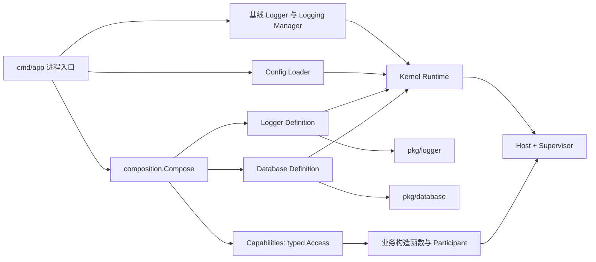
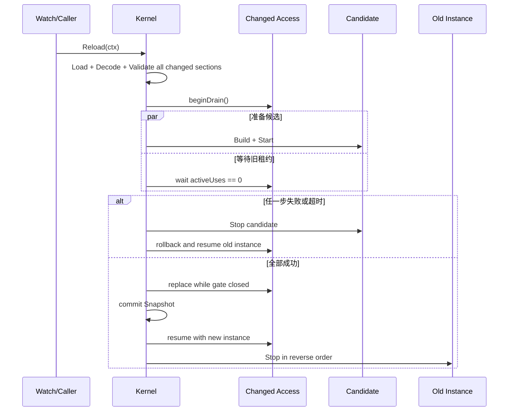

# 当前架构事实

## 一句话定位

当前实现是“显式组合清单 + typed Capability Definition + 稳定租约 Access + 配置事务 + 进程 Supervisor”，不是通用业务 DI 容器。

## 实际装配链

代码事实如下：

1. `cmd/app` 在加载业务配置前创建基线 logger 和 `logging.Manager`，并把 manager 作为 `kernel.New` 的必填参数。
2. `kernel.New` 只创建空 Runtime，不扫描包、不反射发现能力，也不默认登记任何实现。
3. `composition.Compose` 按 Logger、Database 固定顺序调用 `kernel.Register`，同时聚合默认配置契约和可选 CLI contract。
4. `Register` 校验 ID、配置路径、Decoder、Defaults、Builder 和 Hooks，冻结登记结果并返回稳定 `Handle`。
5. 业务侧接收 Logger/Database 专用的 `Access`，不能取得 Kernel、Resolver 或资源关闭权。
6. `NewHost` 把 Kernel 放在第一个 Supervisor Participant，随后才是上层 Participant；停止顺序反向，因此上层先退出，Kernel 资源后释放。

## Definition 不是普通 Provider

`kernel.Definition[C, T]` 同时描述：

- 能力稳定 ID 和所属配置段；
- 从完整 Snapshot 解码并校验 typed 配置；
- 默认配置契约；
- 根据配置构造全新实例的 Builder；
- 候选实例的 Start/Stop；
- 可选的不可失败 Activate/Deactivate。

主流 DI Provider 通常回答“如何从依赖构造对象”。当前 Definition 还回答“如何从配置重建一代资源、何时确认就绪、如何发布和清理”。这使它更接近资源代际描述，而不是通用构造函数注册。

## 稳定 Access 与租约

`Handle.Use` 在回调开始时获取当前实例并增加 `activeUses`，回调返回时释放租约。重载开始后，Handle 进入 draining：

- 已进入的回调可以继续完成；
- 新回调等待切换完成或其 Context 取消；
- 只有旧实例租约归零后才能替换；
- 调用方不得让 Client、Rows、Row、事务或其他派生资源逃逸回调。

这与主流脚手架直接把 `*sql.DB`、repository 或接口保存到对象字段的做法根本不同。稳定 Access 提供了可替换性，但把资源使用时长变成了架构契约。

## 启动事务

Kernel 初次启动执行：

1. 加载不可变配置 Snapshot；
2. 按登记顺序计算配置段摘要、Decode 和校验；
3. 按登记顺序 Build、Start 候选；
4. 任一失败时反向停止已构造候选，并保留完整错误链；
5. 全部成功后才发布各 Access；
6. 记录 Snapshot 并进入 running。

当前实现没有依赖 DAG。顺序只是 composition 显式约定的生命周期顺序，不能表达“Database Builder 依赖 Logger Access”之类的能力图。

## 重载事务

重要语义：

- 先对所有变化配置完成 Decode/Validate，再阻断调用；
- 候选构造与等待旧租约排空并行；
- 提交前失败会丢弃候选并恢复旧实例；
- 多个变化能力在同一提交区统一替换和恢复服务；
- 提交后旧实例清理失败返回 `CommittedCleanupError`，不伪装为可回滚失败；
- 配置段摘要未变化时不重建实例。

## 已守住的边界

- `pkg/*` 不导入 `internal/*`，通用能力库不感知 Kernel、DI 或热替换。
- Capability 不允许 `init` 自注册、调用 `kernel.Register`、反射或文件系统扫描。
- composition 是唯一能力选择和登记位置。
- 第三方类型通过项目自有契约收敛；资源关闭权不泄漏给业务侧。
- 基线 logger 始终可用，配置化 logger 只在整轮事务成功后接管。

## 当前未实现能力

- 业务 service/use case/handler 的对象图构造和校验；
- Capability 之间的依赖声明、拓扑排序和受影响闭包计算；
- named/qualified/multi-binding、模块替换或 scope；
- 可查询的装配 Plan、图可视化或统一诊断接口；
- 除 Logger、Database 外的真实受托管能力；
- 跨进程配置协调或分布式事务。

这些缺口不是现有 API 的隐藏能力，也不应在比较时写成已经实现。
