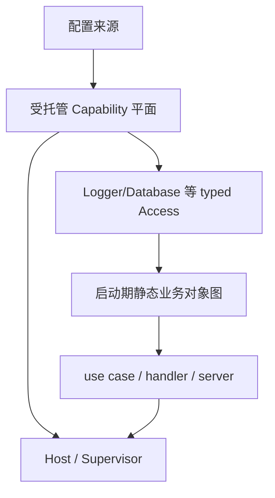

# 演进建议

## 总体建议：保留双平面，而不是统一成一个容器



受托管平面负责资源代际、配置事务和租约；静态平面负责普通构造函数依赖和业务边界。二者通过窄 Access 相接，不共享通用 Resolver 或 Container。

## P0：先建立 Capability 准入标准

新能力只有同时满足大部分条件时才进入 Kernel：

- 拥有需要关闭的进程级资源；
- 配置变化需要重建而不是原地修改；
- 失败时继续使用旧实例具有明确价值；
- 单次使用可以被 `Use` 回调完整包围；
- 调用方不需要长期持有派生对象；
- 当前版本可保持与其他 Capability 独立；
- 能定义明确的 ready、stop、timeout 和错误语义。

不满足时优先选择：

- 纯函数或无资源能力：保持 `pkg` 直接构造/调用；
- 业务对象：在应用 composition root 用构造函数注入；
- 只需重启生效的资源：作为静态应用依赖，由 Host 管理关闭；
- 需要复杂跨资源依赖的能力：先形成单独设计，不直接加入当前 v1 Definition。

该准入标准可以防止 Kernel 变成另一种全能 DI 容器。

## P0：保持业务依赖最小化

不要把完整 `composition.Capabilities` 传给每个 service。composition root 应从中取出调用方真正需要的 Logger Access、Database Access 等，并通过构造函数逐项注入。

这吸收了 go-clean-template 的窄接口优点，并避开大 `ServiceContext` 的扩散。当前 `applicationLifecycle` 只接收 Logger Access 是正确方向。

## P1：补足可观察的装配事实

在真实能力继续增加前，可单独设计只读、不可执行的装配视图，至少表达：

- 已登记 ID、配置路径和登记顺序；
- 是否带 ActivationHooks；
- 当前状态、配置摘要和最近一次重载结果；
- 默认配置契约的归属；
- 不包含资源实例、DSN 或其他敏感值。

这借鉴了 Wire 生成代码可审阅和 Fx 事件可诊断的优势，但不引入容器查询能力。该建议尚未实现，需要另行建立变更任务和确认接口。

## P1：为 Access 约束建立能力级验收

每个新 Capability 除普通单元测试外，应验证：

- 回调期间旧实例不会提前关闭；
- draining 后新调用可被 Context 取消；
- 候选失败恢复旧代；
- cleanup 失败被标记为已提交；
- 派生资源的消费和关闭在回调内完成；
- 长租约触发超时时没有静默成功或资源泄漏。

Database 这类能返回事务和 Rows 的能力尤其需要示例与测试共同约束，因为 Go 类型系统无法阻止值逃逸。

## P1：维持手工静态业务装配

当前业务对象图很小，Google Wire 官方也建议小型应用优先手工 wiring。此时引入 Fx 会新增运行时图和反射认知成本，引入 Wire 则会新增已归档生成器的长期依赖。

建议先使用普通构造函数：

```text
cmd/app
  -> composition.Compose(runtime)
  -> NewRepository(databaseAccess)
  -> NewService(repository, loggerAccess)
  -> NewServer(service)
  -> NewHost(runtime, server)
```

当出现以下可测量信号时再评估 DI 自动化：多个二进制重复大量 wiring、对象图频繁漏接、profile 数量增长、生成/审阅成本低于手工维护成本。评估应作为独立研究，不与 Capability Runtime 扩展捆绑。

## P2：谨慎处理 Capability 依赖

短期继续保持能力彼此独立。遇到看似需要依赖的场景时，优先判断：

1. 依赖是否只是诊断日志，可通过始终可用的 Kernel logging manager 解决；
2. 两个资源是否应在同一个 Capability 内由一个 Builder 共同拥有；
3. 上层业务是否才是真正的组合位置；
4. 是否能接受进程重启，从而留在静态对象图。

只有出现无法规避的受托管依赖，才设计 DAG。设计必须同时覆盖候选代引用、变化闭包、拓扑构造、反向停止、跨能力租约、提交原子性和循环诊断。单独增加 `DependsOn` 字段不构成完整方案。

## P2：按进程 Profile 拆分清单时仍保持显式

如果未来同一仓库产生 API、Worker、CLI 等多个二进制，可让每个进程拥有独立的 composition profile，并复用小的 `registerLogger`、`registerDatabase` 函数。不要通过扫描、`init` 或环境变量自动发现启用项。

Profile 应在源码中可搜索、可测试，并返回该进程真正使用的窄结果；不能变成动态模块市场或 Service Locator。

## 不建议事项

- 不用 Fx/Dig 替换当前 Kernel 的配置事务。
- 不在新代码中默认引入已归档的 Google Wire。
- 不把 `Capabilities`、Kernel、Handle 或 Resolver 整体下传给业务层。
- 不让 Capability 直接 import 或登记其他 Capability。
- 不为 Clock、ID、Validator 等无资源能力机械增加 Definition/Access。
- 不在没有真实调用场景时提前设计 named binding、scope、插件发现或通用 DAG。

## 建议优先级与触发条件

| 优先级 | 建议 | 触发条件 | 当前状态 |
| --- | --- | --- | --- |
| P0 | Capability 准入标准 | 下一项底层能力评审前 | 研究建议，未实施 |
| P0 | 业务构造函数只接收最小 Access | 引入首个真实业务对象图时 | 当前示例方向符合 |
| P1 | 只读装配/重载事实 | 能力数量增加、排障成本上升时 | 未设计 |
| P1 | 能力级 Access 语义验收 | 每个新受托管能力 | Logger/Database 已有部分覆盖 |
| P1 | 手工静态业务装配 | 当前阶段 | 推荐默认 |
| P2 | Capability DAG | 出现不可规避的受托管依赖 | 明确暂缓 |
| P2 | 显式进程 Profile | 出现多个真实二进制组合 | 明确暂缓 |

## 决策结论

当前架构与主流方案不是简单的先进/落后关系，而是选择了更窄但更强的运行期资源管理目标。应保留其在配置事务、排空和资源所有权上的差异化价值，同时用普通 Go 构造函数补上未来的业务静态图。只有真实规模证明手工 wiring 不再经济时，才选择仍被维护的自动化方案；不要为追赶“主流 DI”而牺牲已经明确的重载语义。
