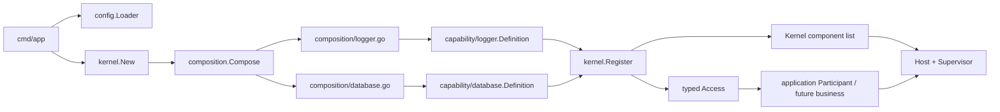

# 当前路径与困惑来源

## 1. 当前真实装配链

当前实现不是“封装一个库，然后把实例传进应用”这么短的路径。Logger 和 Database 的真实路径是：



入口需要完成以下动作：

1. 构造基线 Logger Resource 和 Kernel logging manager；
2. 选择 File/Env 配置源并创建空 Kernel；
3. 调用 `composition.Compose` 登记 Logger、Database；
4. 可选构造启动前 CLI；
5. 从组合结果取得 typed Access；
6. 构造业务 Participant；
7. 创建 Host 并运行 Supervisor。

`kernel.New` 不会自动发现或登记能力。真正的选择发生在 `internal/kernel/composition`，真正的资源构造要等 `Kernel.Start` 加载配置后才发生。

## 2. 新增一个能力目前需要理解什么

以 Database 为例，能力接入者至少要同时理解：

- `pkg/database` 的业务接口、Config、构造入口和 Close 所有权；
- Kernel `Definition[C,T]` 的 ID、ConfigPath、Decode、Defaults、Builder、Hooks 和可选 Activation；
- `kernel.Register` 为什么返回稳定 Handle 和默认配置 Binding；
- `Access.Use` 为什么要求 Client、Rows、Row 和事务都不能逃逸回调；
- composition 为什么还要为每项能力创建同名文件和私有 binding；
- 总 `Capabilities` 为什么要增加字段；
- DefaultManager 和可选 CLI 怎样聚合能力契约；
- 登记顺序怎样影响启动、提交和反向关闭；
- Reload 怎样构建候选、阻断新租约、等待旧租约并替换实例；
- Host 和 Supervisor 如何管理 Kernel 与上层 Participant。

这些概念各自都有价值，但缺少一个从开发者任务出发的入口。当前文档优先解释运行机制，没有先给出“新能力最少改哪些位置、每个位置只负责什么”的黄金路径。

## 3. 当前 Definition 为什么显得重

当前 `Definition` 不是普通 DI Provider。普通 Provider 通常只表达：

```text
dependencies + config -> instance + cleanup + error
```

当前 Definition 同时表达：

```text
能力身份
+ 配置段所有权
+ typed 解码与校验
+ 默认配置生成
+ 实例构造
+ 启动与关闭
+ 可选发布激活
+ 运行期换代所需元数据
```

因此它更接近“资源代际说明书”，而不是“构造函数注册”。当所有底层能力都从 Definition 开始学习时，无资源的简单能力和真正需要热换代的资源能力看起来一样复杂。

## 4. 当前 Reload 已经实现了什么

当前 `Kernel.Reload` 已具备以下真实行为：

1. 重新加载完整配置快照；
2. 对变化配置段完成 Decode 和校验；
3. 关闭受影响 Handle 的新租约入口；
4. 并行构建、启动候选并等待旧租约排空；
5. 提交前失败时丢弃候选、恢复旧实例服务；
6. 成功时替换 Handle 中的实例并恢复调用；
7. 反向 Stop 已被替换的旧实例；
8. 提交后清理失败返回 `CommittedCleanupError`，不回滚新配置。

这是一套严肃的运行期换代协议，而不是普通配置回调。它解释了 Kernel 内部代码量，但也暴露出当前模型与最新目标之间的差距：

- 没有组件级重载策略，所有受托管能力进入同一种候选换代路径；
- 没有切换后的观察期；
- 成功切换后旧实例立即进入 Stop，不再可用于回切；
- `pkg/health` 尚未作为候选 Ready 或观察期 Health 的 Kernel 契约；
- 对不能双实例并存的排他资源，没有 `ComponentHandoff` 或 `RestartRequired` 表达。

## 5. 为什么用户不知道从何下手

困惑主要来自三个断点。

### 5.1 目录语言与心智模型不一致

使用者想的是“通用库 → 可运行组件 → 手动装配”，当前目录表达的是“通用库 → capability definition → composition”。`capability` 没有直接说明它是一个带配置和生命周期的“应用组件”，而 `composition` 又同时承担登记、默认配置和 CLI 聚合。

### 5.2 简单替换与运行期换代被混为一谈

“第三方库可替换”只要求 `pkg` 对第三方类型形成稳定边界，并让 composition 可以选择另一实现。它不天然要求每次业务调用都进入租约，也不天然要求进程内同时维持两代资源。

当前模型直接把运行期换代作为受托管能力的通用语义，使开发者在替换一个数据库驱动之前，先被迫理解资源代际状态机。

### 5.3 缺少真实业务对象图作为终点

当前还没有 repository、service、handler 和 HTTP server 纵切。虽然文档说业务构造函数应接收窄 Access，但开发者看不到完整终点：Database Access 到底由谁持有、事务在哪一层结束、Server 怎样进入 Host、Middleware 怎样拿 Logger。

这不是要求现在提前实现业务层，而是要求文档把未来边界画清楚。否则底层装配像一条没有消费者的管道，很难判断每个抽象是否必要。

## 6. 本报告的问题定义

需要解决的不是“怎样增加更多自动化”，而是：

- 让组件作者从一个清晰入口完成封装和手动登记；
- 让简单能力不为不需要的热换代付出成本；
- 让确实需要无感重载的能力继续获得强状态机保障；
- 让排他资源可以如实声明无法通用无感换代；
- 让业务层继续使用最直观的普通 Go 构造函数；
- 把复杂性留在拥有复杂责任的 Kernel 内，而不是扩散到每个调用方。
