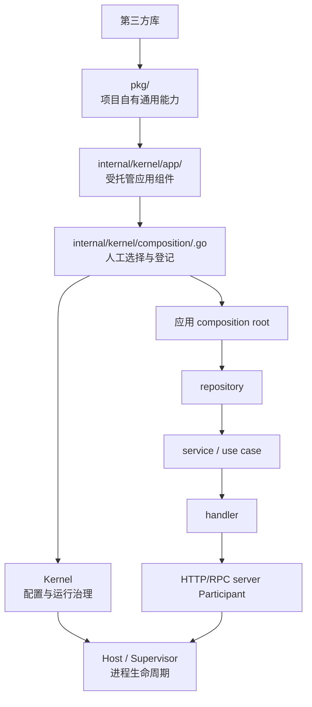

# 目标组件模型

> 本章描述目标设计，不是当前公共 API。当前实现仍使用 `internal/kernel/capability/<name>` 和 `kernel.Definition`。

## 1. 四段式边界



### 1.1 `pkg/<name>`：通用能力层

职责：

- 隔离第三方类型、错误和配置细节；
- 定义项目实际需要的窄能力接口；
- 提供可直接调用的构造入口；
- 明确资源所有者和 Close 语义；
- 提供无 Kernel 依赖的单元测试。

禁止：

- 导入 `internal/kernel`；
- 自注册、读全局配置或启动后台任务而没有所有者；
- 把第三方 Client 作为业务公共类型泄漏；
- 为了接入 Kernel 改变通用库的独立可用性。

第三方库替换主要发生在本层。只要项目自有接口、配置语义和错误语义保持稳定，上层组件及业务调用方不应知道实现已经变化。

### 1.2 `internal/kernel/app/<name>`：应用组件层

职责：

- 把 `pkg` 能力适配为 Kernel 可托管组件；
- 声明稳定组件 ID 和配置段；
- 组合实际需要的配置、Build、Start、Ready、Stop、Health、CLI 和 Reload Policy；
- 收敛业务 Access，阻止关闭权或内部实例逃逸；
- 不决定自己是否加入某个进程。

每个包只暴露一个组件定义入口，例如目标伪代码：

```go
// 目标设计，尚未实现。
func Definition(deps Dependencies) kernelapp.Definition[Config, Instance, Access]
```

泛型形状和包名需要在后续变更设计中确认，本报告只冻结行为边界：调用一个入口即可取得完整组件声明，不再要求 composition 手工理解和拆装内部 Handle。

### 1.3 `internal/kernel/composition/<name>.go`：人工装配层

职责：

- 为当前进程选择具体组件实现；
- 显式提供组件依赖；
- 调用唯一登记入口；
- 返回应用实际使用的 typed Access 或其他启动前结果；
- 让登记顺序和启用清单可搜索、可审阅、可测试。

示意：

```go
// 目标设计，尚未实现。
func composePkgName(runtime *kernel.Kernel, deps pkgnameapp.Dependencies) (pkgnameapp.Access, error) {
	return kernelapp.Register(runtime, pkgnameapp.Definition(deps))
}
```

它不负责实现 Config、Build 或 Stop，不读取运行中的实例，也不变成通用 Resolver。

### 1.4 Kernel 与 Host：运行治理层

Kernel 负责：

- 冻结登记结果；
- 加载、解码和校验配置；
- 按策略构建、启动、检查、重载和停止组件；
- 管理稳定 Access 和使用租约；
- 维护当前代、候选代和可回滚上一代；
- 输出不包含敏感值的状态与错误诊断。

Host/Supervisor 负责：

- 按顺序启动 Kernel 和业务 Participant；
- 监督长期 Task、信号和失败取消；
- 按反向顺序优雅停止业务和 Kernel；
- 对停止阶段施加时间边界。

Kernel 不负责：

- 自动扫描组件；
- 构造 repository、service、handler、model；
- 在运行期按类型查找业务依赖；
- 通过环境变量偷偷决定启用哪些组件；
- 替排他资源发明并不存在的无感交接能力。

## 2. 小契约组合

目标组件入口可以组合以下独立职责，而不是一个巨型 `Component`：

| 契约 | 是否必需 | 作用 |
| --- | --- | --- |
| Identity/Config Path | 托管组件必需 | 标识组件及配置所有权 |
| Decode/Validate | 有配置时必需 | 产生 typed 配置，不执行资源 I/O |
| Defaults | 需要配置生成时可选 | 贡献自身配置段默认骨架 |
| CLI Contract | 有启动前命令时可选 | 贡献组件自有命令，不自行创建 App |
| Builder | 需要实例时必需 | 创建一代未发布实例 |
| Starter | 需要启动时可选 | 启动连接、后台任务或监听准备 |
| Ready | 需要就绪门禁时可选 | 判断候选能否接管业务 |
| Stopper | 拥有资源时必需 | 释放当前代、候选代或上一代 |
| Health | 需要持续判断时可选 | 为观察期和运行诊断提供状态 |
| Reload Policy | 配置可变化时必需 | 明确选择五种策略之一 |
| Native Reloader/Handoff | 选中相应策略时必需 | 实现策略专用动作 |
| Access Factory | 不直接暴露实例时需要 | 生成窄业务入口并保护资源所有权 |

“可选”表示组件定义中不存在该职责，而不是提供一个什么都不做的空方法。Kernel 应按声明能力编排，而不是让每个组件实现全部方法。

## 3. 组件准入标准

只有满足以下一项或多项的能力才进入 `kernel/app`：

- 拥有进程级资源，需要统一 Start/Stop；
- 有长期 goroutine 或运行错误需要 Supervisor 管理；
- 需要统一配置监听和受控重载；
- 需要健康、就绪或资源代际诊断；
- 必须避免业务调用方取得 Close 权限；
- 多个上层对象需要共享同一个受治理实例。

通常不进入 Kernel：

- 纯 Clock、ID Generator、Validator、Codec 等无资源值；
- 单个业务对象私有且生命周期跟随其所有者的依赖；
- repository、service、handler、middleware、model；
- 只在一个局部函数内使用的第三方库；
- 没有真实替换、治理或共享需求的机械接口。

这些能力仍可放在 `pkg`，由应用 composition root 直接构造并通过普通参数注入。

## 4. Access 的使用范围

稳定 Access 只有在 Kernel 需要知道“当前一代是否仍被使用”时才有价值。目标设计应允许两类交付：

- **直接能力**：不做运行期实例换代的能力，业务直接持有项目自有接口；
- **租约 Access**：选择 `KernelInstanceSwap` 或需要受控交接的能力，业务在有界回调中使用当前实例。

不能把完整 `Capabilities` 传给每个业务对象。composition root 应拆出最小依赖：

```go
repo := orderrepo.New(capabilities.Database)
service := orderservice.New(repo, capabilities.Clock)
handler := orderhandler.New(service, capabilities.Logger)
```

具体构造函数由未来真实业务定义；上例只表达依赖方向，不声明当前已有这些包。

## 5. 可替换性的四个检查层次

替换第三方库不能只检查 import：

1. **类型边界**：业务接口、配置和错误不暴露第三方类型。
2. **语义边界**：超时、事务、关闭、重试和错误识别语义由项目契约定义。
3. **装配边界**：只有 `pkg` 实现或 `kernel/app` 适配器需要随第三方实现变化。
4. **验证边界**：契约测试可对旧实现和新实现重复运行，证明替换不是只靠编译通过。

这四层完成后，即使组件的 Reload Policy 是 `RestartRequired`，底层第三方库仍然是可替换的。运行期热换代不是判断可替换性的必要条件。
