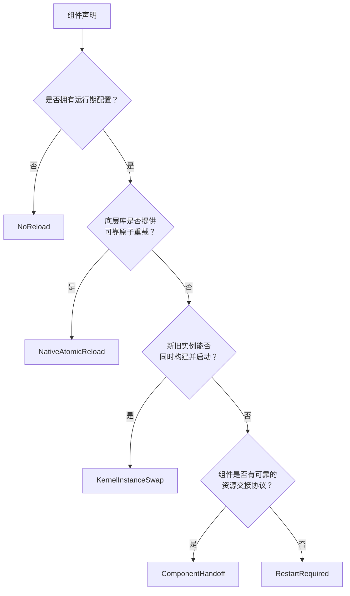
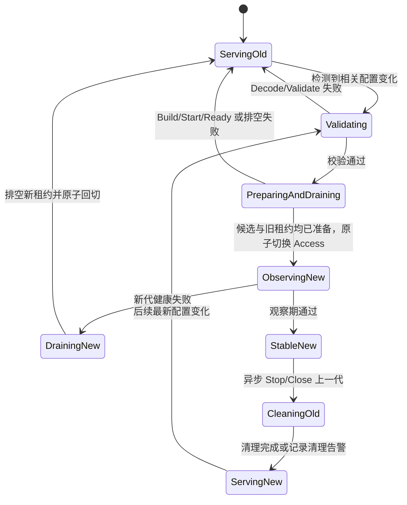

# 组件级重载策略

> 006 已实现 `NoReload`、`KernelInstanceSwap` 和 `RestartRequired` 的第一阶段状态机；`NativeAtomicReload`、`ComponentHandoff`、观察期和切换后回滚仍是目标设计。当前差异见本章末尾。

## 1. 选择策略，而不是统一套用 Reload

组件作者在封装底层库时，必须基于可验证事实选择重载策略。判断顺序如下：

策略必须成为组件定义的显式、可查询元数据。不能通过某个 Hook 是否为 nil、是否实现了同名方法或包目录来猜测。

## 2. `NativeAtomicReload`

### 2.1 准入证据

只有底层库同时满足以下要求才可选择：

- 对外明确承诺配置应用是并发安全的；
- 调用成功后，新配置整体可见，不出现部分字段已生效；
- 调用失败后，旧配置和旧运行状态继续有效；
- 重载过程不会泄漏旧资源、goroutine 或文件句柄；
- Context、超时和错误链可以被项目契约保留；
- 项目能够用测试或上游保证验证上述语义。

仅仅存在 `Reload`、`SetConfig`、`Reset` 或多个 setter，不构成原子重载证据。若必须连续调用多个 setter，且中间状态会被业务观察到，就不属于该策略。

### 2.2 Kernel 编排

Kernel 加载并验证新配置后，在组件自身的串行边界内调用 Native Reloader。成功后提交配置摘要；失败时保留旧摘要和旧实例，并通过基线日志输出组件 ID、阶段、错误类型和结果。日志不得包含 DSN、Token、密码或完整配置快照。

该策略不创建第二个实例，也不需要业务租约排空，前提是底层库已经承担了并发和原子性。

## 3. `KernelInstanceSwap`

### 3.1 适用条件

- 底层库没有可靠的原子重载；
- 可以使用新配置构建独立候选实例；
- 新旧实例能在观察期内同时保持已启动状态；
- 业务对实例的单次使用能够被有界租约包围；
- 派生资源不会逃逸租约，或组件能将派生资源纳入同一租约；
- 双实例期间的连接数、内存、文件句柄和外部配额可接受。

Database 不能仅因“连接池可以创建两个”就自动采用该策略。还要确认事务、Rows、Row、prepared statement、session 和驱动特有对象不会逃逸，外部数据库也能承受两代连接池同时存在。

### 3.2 两阶段切换

详细流程：

1. **加载和验证**：产生不可变候选配置；任何错误都发生在阻断业务之前。
2. **并行准备**：校验通过后，一侧创建新实例并执行 Start、Ready，另一侧关闭旧实例的新租约入口并等待已有租约结束。候选不可被业务访问；旧实例已有调用继续完成，新调用等待切换或 Context 取消。
3. **提交前失败**：任一侧失败或超时时，恢复旧实例入口，Stop 已创建的候选并保留旧配置。候选 Stop 失败与主错误使用错误链一起报告。
4. **原子切换**：候选 Ready 且旧租约归零后，在不可失败提交区替换 Access 指向并恢复新调用。
5. **观察新代**：旧实例继续保持 Started，但不再接收新租约；新业务调用只进入新实例。
6. **观察失败回切**：关闭新实例的新租约入口，等待已有新租约结束，然后把 Access 原子切回仍保留的旧实例，恢复业务调用，最后 Stop 失败的新实例。
7. **观察通过确认**：新代成为稳定当前代；旧代失去回滚资格。
8. **异步清理旧代**：执行 Stop/Close。失败产生清理告警，但不回滚已经稳定的新代。

### 3.3 观察期

观察期是组件策略参数，不应成为散落的魔法值。后续实现设计至少需要固定：

- 正的观察时长及集中默认值；
- Health 检查周期、单次超时和成功/失败阈值；
- 什么错误属于新实例运行失败；
- Context 取消和进程关闭时怎样终止观察；
- 观察期状态怎样进入只读诊断视图。

Ready 回答“候选现在是否可以接管”，Health 回答“接管后是否持续可用”，二者不能用同一个无语义布尔值混淆。

观察期只能降低刚切换后发现问题的恢复时间，不能保证旧实例永远可用。上一代可能因外部服务故障而同时失效；后续实现必须在回切前确认其仍满足组件定义的可恢复条件，并为新旧两代均不可用提供明确的致命错误和进程策略。

### 3.4 代际与并发不变量

- 正常状态最多持有一个当前代；观察期间最多持有当前新代和可回滚上一代。
- 不允许连续变化无限创建候选或保留多代资源。
- 同一组件一次只运行一个重载事务。
- 观察期出现后续变化时只保存最新候选配置；当前事务确认或回滚后，再串行启动一次新事务。
- 被覆盖的中间配置不构造实例，但应在诊断中记录发生过合并。
- 进程关闭优先停止业务 Participant，使新租约自然停止；随后 Kernel 关闭候选、当前代和保留旧代，并保留所有清理错误。
- 旧代在观察期内不得执行 Stop、Close 或不可逆 Deactivate，否则不再具备回切资格。

## 4. `ComponentHandoff`

### 4.1 适用资源

- 同一地址和端口的 HTTP/RPC listener；
- 排他文件锁或设备句柄；
- 只能存在一个所有者的消费分区；
- 带单活租约的调度器或领导者资源；
- 新旧实例并存会破坏协议语义的组件。

这类组件不能直接套用通用双实例 Start。组件必须提供经过验证的专用交接协议，例如复用已打开 listener、暂停接收后转移所有权，或使用底层系统明确支持的 rebalance/fencing。

Kernel 只编排交接步骤、超时、错误和诊断，不猜测组件内部资源如何转移。每种 Handoff 必须单独设计以下内容：

- 交接前新实例可准备到哪一步；
- 哪个动作是不可逆提交点；
- 提交前和提交后的失败分别怎样处理；
- 旧连接、请求、消息或锁租约怎样排空；
- 是否真的支持切换后回滚；
- 进程退出与配置交接并发时谁优先。

没有完整答案时必须选择 `RestartRequired`。

## 5. `RestartRequired`

组件仍由 Kernel 构建、启动、健康检查和关闭，但相关配置变化不在当前进程中应用。Kernel 应：

- 校验新配置能否被识别；
- 报告组件 ID、变化路径和“需要重启”状态；
- 保持当前实例和当前有效配置不变；
- 不执行停旧启新；
- 不自动重启进程，除非未来有单独确认的进程管理设计。

这不是能力缺失，而是对排他资源和失败边界的诚实表达。部署平台通过滚动重启通常比进程内模拟无感切换更可靠。

## 6. `NoReload`

适用于没有运行期配置，或实现和构造参数由代码中的 Definition/composition 固定选择的组件。Clock、ID Generator、Validator 的默认目标声明属于该策略。

`NoReload` 表示组件根本不参加运行期配置事务，不是“收到了配置但选择忽略”。如果组件声明了 `ConfigContract`，就必须从 `NativeAtomicReload`、`KernelInstanceSwap`、`ComponentHandoff`、`RestartRequired` 中显式选择配置生效方式；不允许用 `NoReload` 掩盖无法处理的配置变化。

## 7. 错误与日志

重载错误必须继续向上返回或进入明确的持续监听错误回调，同时只在决定处理策略的边界记录一次。建议诊断字段包括：

- component ID；
- reload strategy；
- generation/transaction ID；
- phase：decode、build、start、ready、drain、switch、observe、rollback、cleanup；
- outcome：kept-old、switched、rolled-back、restart-required、cleanup-warning；
- duration 和 timeout；
- 保留原始原因的错误链。

不得记录完整配置、DSN、Token、密码、密钥或第三方 Client dump。配置监听失败与单次组件重载失败要区分：前者会终止 Watch Task，后者由回调报告后继续监听。

## 8. 与当前实现的明确差异

| 行为 | 当前实现 | 目标设计 |
| --- | --- | --- |
| 配置变化策略 | 已实现 NoReload、Swap、RestartRequired | 后续补充 Native 与 Handoff |
| 候选 Build/Start/Ready | 已实现 | 保留 |
| 旧租约排空 | 已实现 | 保留 |
| 提交前失败保留旧代 | 已实现 | 保留 |
| 原子替换 Lease Access | 已实现 | 保留 |
| 切换后旧实例 | 立即反向 Stop | 观察期内保留为上一代 |
| 切换后 Health | 未实现 | 观察期持续检查 |
| 切换后自动回切 | 未实现 | 健康失败后排空新租约并回切 |
| 排他资源策略 | 可选择 RestartRequired | 后续增加 Handoff |
| 后续配置变化 | Watch 串行触发 Reload | 观察期合并最新变化后串行处理 |

因此后续观察期、Native 与 Handoff 不能只在现有 `Definition` 增加枚举字段。它们会改变实例所有权、Stop 时机、Kernel 状态机、Watch 排队、健康契约、错误类型、测试矩阵和诊断视图，必须作为独立架构变更设计。
