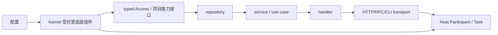

# 业务层边界

## 1. 为什么业务对象不进入 Kernel

Kernel 解决的是少量底层资源的运行治理。repository、service、handler、middleware 和 model 解决业务规则、数据访问和协议适配。把它们全部注册为 Kernel Component 会产生三个问题：

- 普通对象被迫实现不需要的配置和生命周期协议；
- 业务依赖图与资源代际状态机耦合，Reload 一个底层资源可能被误解为重建整个业务图；
- 调试必须穿过运行时容器或 Resolver，失去普通 Go 构造函数和编译器的直接反馈。

因此目标架构明确维持两个平面：



受托管平面允许内部实例换代，但交给业务的是身份稳定的 Access。业务静态对象图只在进程启动时构造一次，不需要随 Database Client 的代际变化重建。

## 2. 建议的职责划分

### 2.1 Model

- 表达领域实体、值对象、命令、查询和业务不变量；
- 不依赖 HTTP、ORM、Kernel 或第三方数据库类型；
- 不作为全局 DTO 在所有层复用；协议 DTO 和持久化映射由各边界拥有。

当前尚无真实业务域，因此不应提前创建空 `model` 目录或通用 BaseModel。

### 2.2 Repository

- 契约由需要数据能力的上层业务定义；
- 实现可以使用 Database Access，但必须把单次数据库工作包围在租约内；
- transaction、Rows、Row、statement 等派生资源不得越过 Access 回调；
- 将数据库错误转换为调用方能够判断的项目业务错误，同时保留原因。

示意：

```go
// 未来示意。
type OrderRepository interface {
	FindByID(context.Context, OrderID) (Order, error)
}

type repository struct {
	database databaseapp.Access
}
```

Repository 不保存当前 `database.Client`，而保存稳定 Access。每个方法在 `Use` 回调中完成查询、结果消费和关闭。

### 2.3 Service / Use Case

- 编排业务规则和 repository；
- 构造函数逐项接收最小接口；
- 不接收完整 `Capabilities`；
- 不直接读取 Kernel 配置，也不主动 Reload 组件；
- Clock、ID Generator 等普通能力可以直接作为接口注入，无需租约。

### 2.4 Handler

- 拥有协议输入解析、校验、调用 service 和输出映射；
- HTTP handler 依赖 service，不依赖 repository 或 Database；
- 不把 `http.Request`、框架 Context 或状态码传播进业务层；
- 取消和 deadline 从协议 Context 向下传播。

### 2.5 Middleware

- 属于传输边界，处理 request ID、认证上下文、访问日志、恢复、CORS、限流等横切协议行为；
- 通过明确构造参数获得 Logger、Clock、ID Generator 或认证能力；
- 不通过全局变量和 Service Locator 取依赖；
- 中间件顺序在路由组合位置显式可见。

### 2.6 HTTP Server

HTTP Server 是长期运行的上层进程参与者，不是普通 repository 依赖。它由 router/handler 构造，并作为 Host Participant 或 Task 启动和优雅关闭。

同端口的新旧 Server 通常不能直接并行 `ListenAndServe`。若未来要求 HTTP 配置无感切换，需要单独确认：

- 仅原地修改可变的 middleware/route 配置；
- 复用 listener 并交接 handler；
- 使用操作系统或代理层提供的连接交接；
- 或声明相关字段 `RestartRequired`。

不能直接套用 Database 式双实例换代。

## 3. 一条未来纵切的装配顺序

当首个真实业务场景出现时，推荐 composition root 保持可读的普通调用链：

```text
1. 创建 baseline logger、config loader 和 Kernel
2. 显式登记进程需要的底层组件
3. 从组合结果取得 Database/Logger 等最小能力
4. NewRepository(databaseAccess)
5. NewService(repository, clock, idGenerator)
6. NewHandler(service, loggerAccess)
7. NewRouter(handler, middleware...)
8. NewHTTPServer(config, router)
9. NewHost(kernel, httpServer, otherParticipants...).Run(ctx)
```

这个调用链本身就是业务依赖图。构造函数缺参数由编译器暴露，构造失败逐层添加上下文并返回。当前阶段没有必要引入 Fx、Wire、Dig 或自研对象图容器。

## 4. 底层实例换代对业务层的影响

业务静态对象图不重建，但必须遵守 Access 边界：

- repository 持有稳定 Database Access，而不是某一代 Client；
- middleware 持有稳定 Logger Access 或动态代理，而不是某一代 Logger Resource；
- 单次业务操作进入 Access 后取得当前实例；
- Reload 开始前已经取得的租约使用旧代完成；
- 切换期间新调用等待或按 Context 取消；
- 切换后新调用进入新代；
- 观察失败回切时同样遵守新代租约排空。

如果某项业务必须长期持有 stream、transaction、subscription 或 session，它可能不适合通用 `KernelInstanceSwap`。应考虑：

- 将长生命周期对象提升为独立受托管组件；
- 使用组件专用 Handoff；
- 或把相关配置标记为 RestartRequired。

不能仅靠文档要求“不要逃逸”掩盖类型和生命周期模型不匹配。

## 5. Health 与业务健康接口

`pkg/health` 当前提供 Registry、分类和 Snapshot，但尚未接入 Kernel 观察期或 HTTP 健康端点。未来应区分：

- **组件 Ready**：候选是否可以接管流量；
- **组件 Health**：当前实例在观察期和正常运行中是否可用；
- **应用 readiness**：当前进程是否应接收外部请求；
- **应用 liveness**：进程是否陷入无法自愈状态；
- **HTTP health endpoint**：只是发布上述状态的协议 Adapter，不拥有健康判断。

不要为了 HTTP endpoint 反向让 Kernel 依赖 HTTP。上层 handler 读取只读健康快照并编码响应即可。

## 6. 当前尚未建设时应做什么

在真实业务到来前：

- 文档只定义依赖方向和 composition root 原则；
- 不提前创建空 handler/service/repository/model 包；
- 不发明 CRUD、BaseRepository、通用分页或统一 DTO；
- 不为证明 Kernel 可用而把具体业务验收代码放入基础仓库；
- 需要验证完整纵切时，使用独立消费者项目，避免污染基础框架边界。

这样既能解释底层能力最终怎样被使用，又不会把尚未确认的业务结构写成当前实现。
